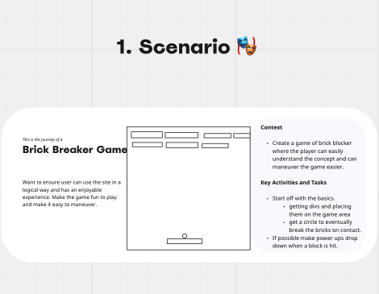
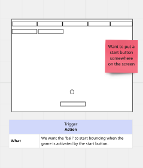
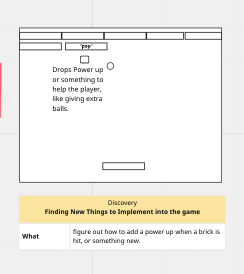
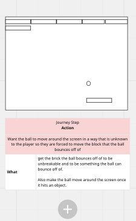
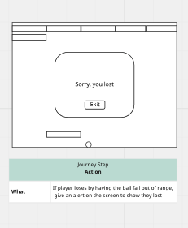
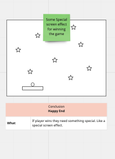

# Project-1

# User Story: 

# Brick Blocker Game

If I were a user I would want to:

Have a great user interface.

Have a game be responsive.

if I am going to pe playing a game I want it to be easily understandable.

probably have a "how to play" button that tells me how to play the game. 

if won, have a screen effect that excites me?

I would want some sort of reward while playing the game. 

have bricks disapear as they are hit. 

 

 

 

 

 

 
